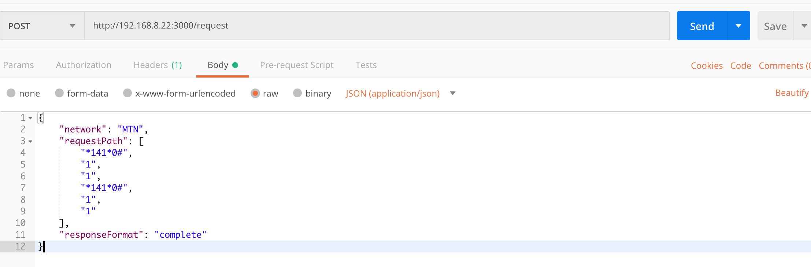
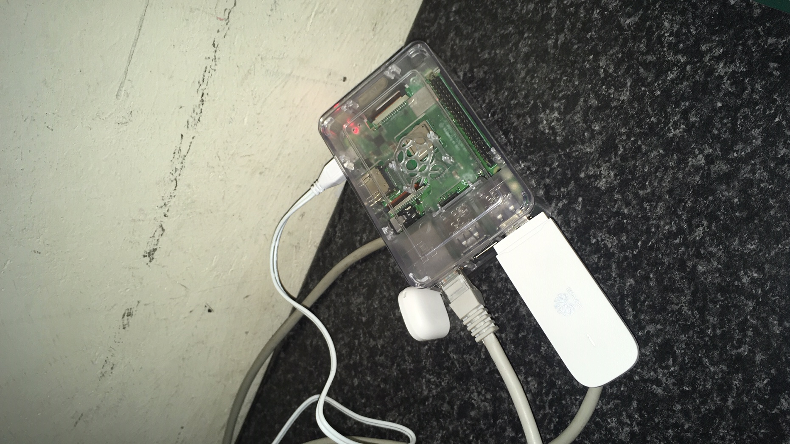

An fastify API server that can run on a Rasberry PI, and interface with a GSM modem through serial commands.
Using these serial (AT-) commands, we can send and receive USSD requests and responses with the mobile carrier of the modem.

API exposes /request route on port 3000.

